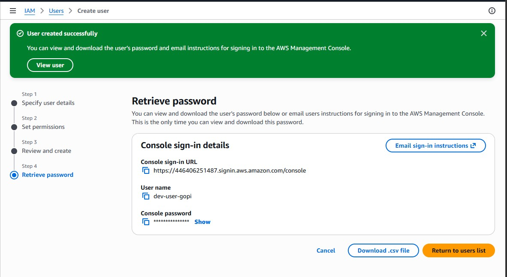
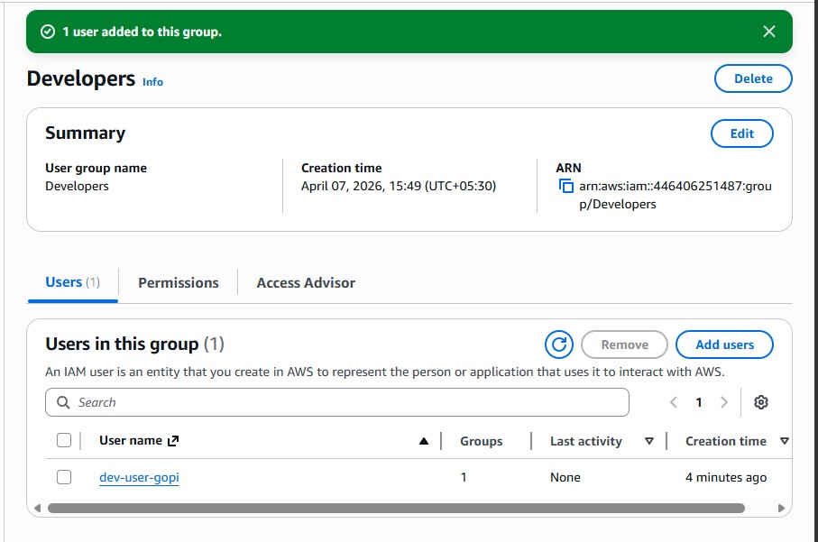
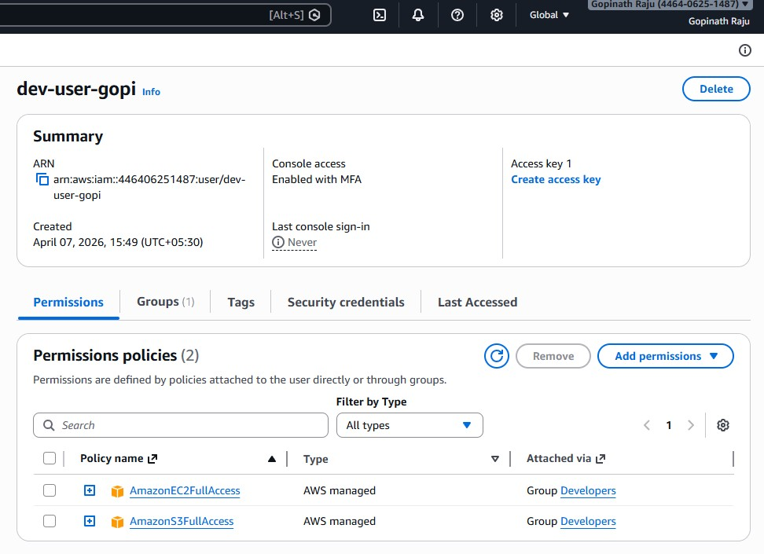
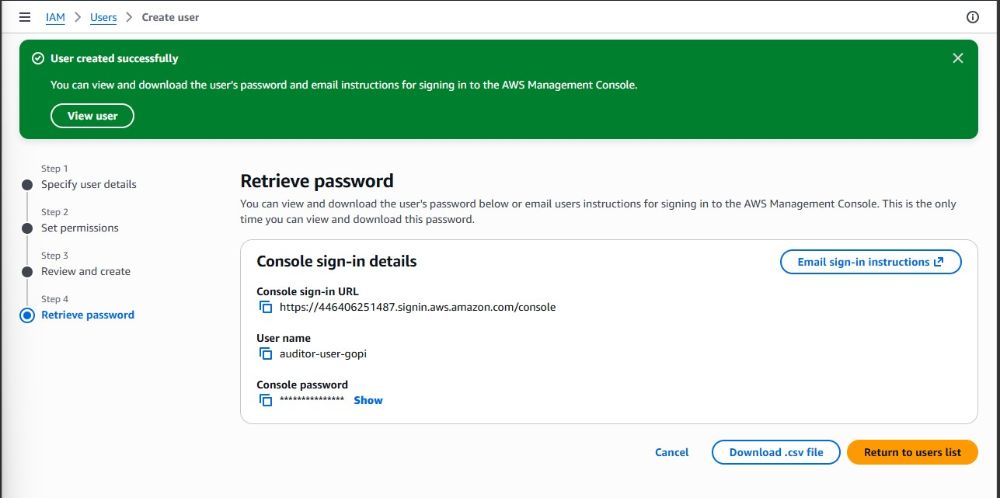
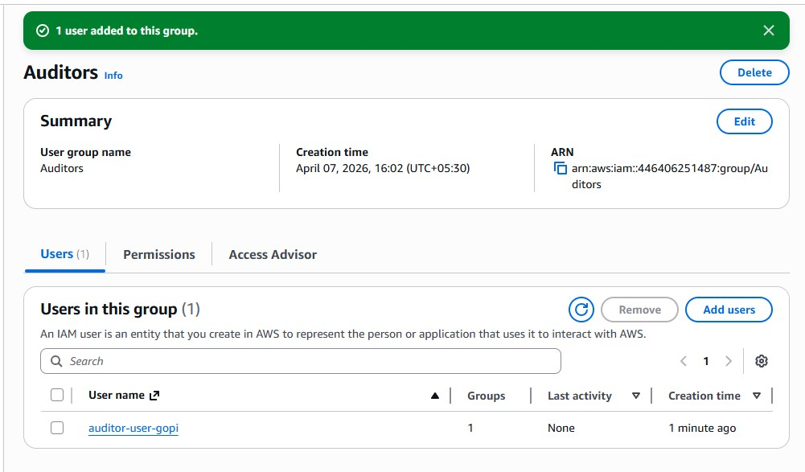
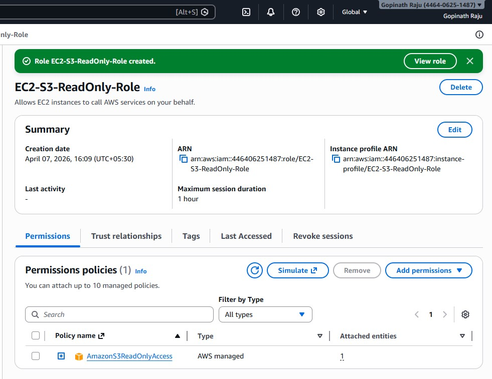
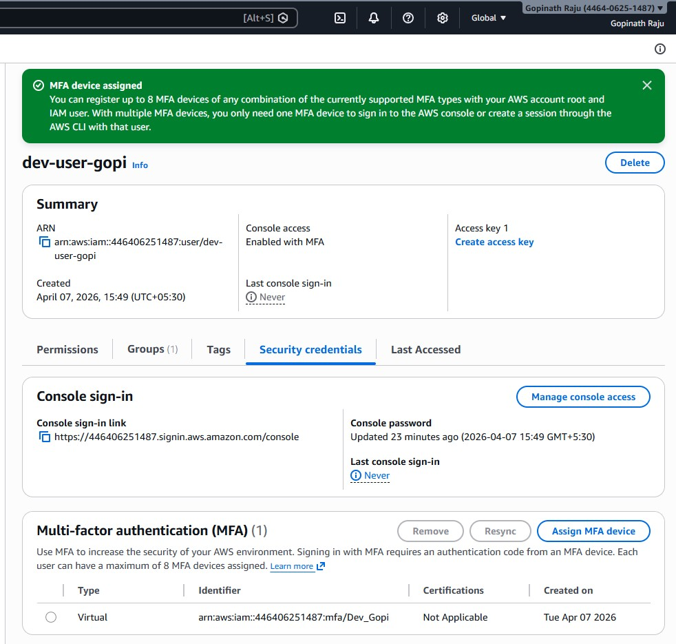

# AWS IAM — Users, Groups, Roles & MFA

## 📌 Overview
Implemented a complete IAM security structure on AWS following the **least privilege principle**. Created users, groups, roles, and enabled MFA.

---

## 🛠️ Services Used
- AWS IAM (Identity and Access Management)

---

## 🏗️ What Was Built

### 👥 IAM Groups
| Group Name | Policies Attached | Purpose |
|---|---|---|
| Developers | AmazonEC2FullAccess, AmazonS3FullAccess | Full EC2 & S3 access |
| Auditors | ReadOnlyAccess | View-only all AWS services |

### 👤 IAM Users
| Username | Group | MFA |
|---|---|---|
| dev-user-gopi | Developers | ✅ Enabled |
| auditor-user-gopi | Auditors | — |

### 🎭 IAM Role
| Role Name | Trusted Entity | Policy |
|---|---|---|
| EC2-S3-ReadOnly-Role | AWS Service — EC2 | AmazonS3ReadOnlyAccess |

---

## 🏛️ Architecture
```
Root Account (MFA ✅)
│
├── IAM Group: Developers
│     ├── AmazonEC2FullAccess
│     ├── AmazonS3FullAccess
│     └── dev-user-gopi (MFA ✅)
│
├── IAM Group: Auditors
│     ├── ReadOnlyAccess
│     └── auditor-user-gopi
│
└── IAM Role: EC2-S3-ReadOnly-Role
      ├── Trusted: EC2
      └── AmazonS3ReadOnlyAccess
```

## 📸 Screenshots

### 1. dev-user-gopi Created


### 2. Developers Group — User Added


### 3. Developers Group — EC2 Access Policy


### 4. Auditor User Created


### 5. Auditors Group — User Added


### 6. IAM Role Created


### 7. MFA Enabled on dev-user-gopi


---

## 🎓 Key Concepts

- **Least Privilege** — Only minimum required permissions
- **Groups = Job Functions** — Manage by group, not per user
- **IAM Roles** — EC2 accesses S3 without hardcoded credentials
- **MFA** — Extra security beyond passwords
- **Never use root** — Create IAM users for all daily tasks

---

## ✅ Best Practices Followed

1. Never use root account for daily operations
2. Assign permissions via groups, not directly to users
3. Use IAM Roles for EC2 — no hardcoded keys
4. Enable MFA on root + admin users
5. Apply least privilege principle

---

**Status:** ✅ Completed | April 2026 | AWS Cloud | Gopinath Raju
